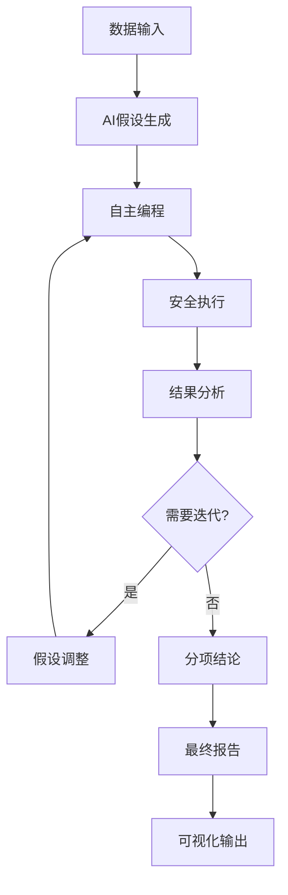

# DeepAnalyze CLI 使用指南

## 🎯 简介

DeepAnalyze CLI 提供命令行接口，支持直接调用本地模块进行数据分析，无需启动src/api服务器。

## 🚀 快速开始

```bash
# 进入CLI目录
cd /home/huangzw/Project/DeepAnalyze/src/cli

# 查看帮助
python direct_cli.py --help

# 交互式模式（推荐）
python direct_cli.py --interactive
```

## 📊 主要使用模式

### 1. 交互式分析（推荐）
```bash
python direct_cli.py --interactive
```
进入交互式界面，可以：
- 逐步执行分析步骤
- 与AI助手实时交互
- 动态调整分析策略
- 查看中间结果

### 2. 批处理模式
```bash
# 完整数据分析
python direct_cli.py --analyze data.csv --analysis-types descriptive inferential

# 生成报告
python direct_cli.py --analyze data.csv --report

# 数据质量检查
python direct_cli.py --analyze data.csv --analysis-types quality
```

### 3. 单独功能调用
```bash
# AI助手问答
python direct_cli.py --query "数据中有什么有趣的模式？"

# 查看会话信息
python direct_cli.py --session-info

# 列出分析结果
python direct_cli.py --results
```

## 🎯 完整分析流程示例

### 从头到尾的一站式分析：

```bash
# 方法1: 使用预设脚本（推荐新手）
cd /home/huangzw/Project/DeepAnalyze/src/cli
./run_complete_docs/analysis.sh

# 方法2: 一步命令完成所有分析
python direct_cli.py --analyze your_data.csv \
    --analysis-types descriptive inferential correlation quality \
    --report \
    --report-type analytical \
    --visualize

# 方法3: 交互式分析（最灵活）
python direct_cli.py --interactive
# 然后在交互界面中逐步执行各项分析
```

### 批处理完整流程示例：

```bash
# 分析Simpson悖论数据集
cd /home/huangzw/Project/DeepAnalyze/src/cli
python direct_cli.py --analyze ../../data/examples/simpson_paradox_docs/analysis/data/Simpson.csv \
    --analysis-types descriptive inferential correlation \
    --report \
    --visualize

# 查看结果
python direct_cli.py --results
python direct_cli.py --session-info
```

## 📁 支持的数据格式

- **CSV文件** (`.csv`) - 最常用格式
- **Excel文件** (`.xlsx`, `.xls`) - Microsoft Excel格式
- **JSON文件** (`.json`) - JavaScript对象表示法

## ⚙️ 参数说明

### 主要参数
- `--analyze FILE`: 分析指定数据文件
- `--analysis-types TYPES`: 指定分析类型（descriptive, inferential, correlation, quality）
- `--query TEXT`: 向AI助手提问
- `--report`: 生成分析报告
- `--visualize`: 生成可视化图表
- `--interactive`: 进入交互模式
- `--session-info`: 显示会话信息
- `--results`: 列出分析结果

### 分析类型
- `descriptive`: 描述性统计分析
- `inferential`: 推断性统计分析  
- `correlation`: 相关性分析
- `quality`: 数据质量检查

## 🛠️ 可用工具

当前可用的分析工具：
- `data_loader` - 数据加载工具
- `data_cleaner` - 数据清洗工具
- `statistical_summary` - 统计摘要工具
- `query_builder` - SQL查询构建器
- `data_extractor` - 数据提取工具
- `performance_optimizer` - 性能优化工具
- `r_bridge` - R语言桥接器
- `r_statistical` - R统计分析工具

## 💡 使用技巧

1. **推荐使用交互模式** - 可以获得最佳的用户体验和灵活性
2. **逐步分析** - 在交互模式下可以逐步执行各个分析步骤
3. **AI辅助** - 随时向内置AI助手咨询分析建议
4. **结果查看** - 使用`--results`参数查看历史分析结果

## 🚨 注意事项

- 确保数据文件编码为UTF-8
- 大文件处理时注意内存使用
- 某些高级可视化功能需要额外的图形库
- 报告生成功能可能需要LaTeX环境支持

## 🆘 故障排除

常见问题及解决方案：
1. **模块导入错误**: 确保在正确的conda环境中运行
2. **文件路径错误**: 使用绝对路径或正确的相对路径
3. **内存不足**: 减少数据量或增加系统内存
4. **权限问题**: 确保对文件有读写权限

## 📊 可视化增强报告功能

### 核心特性

DeepAnalyze CLI 现在支持在分析报告中自动嵌入相关可视化图表，让报告更加直观和专业。

### 🎨 可视化报告优势

- **自动图表嵌入**: 报告中自动包含相关分析图表
- **多种图表类型**: 支持分布图、趋势图、对比图、相关性热力图等
- **学术风格**: 所有图表采用学术出版级别的视觉设计
- **灵活控制**: 可选择包含或排除可视化内容
- **完整分析流程**: 从数据到洞察到可视化的一站式解决方案

### 🚀 使用方法

#### 1. 命令行模式

```bash
# 生成带可视化的完整报告
python direct_cli.py --analyze data.csv --visualize --report --include-visualizations

# 生成纯文本报告（无图表）
python direct_cli.py --analyze data.csv --report --no-visualizations

# 指定报告类型和图表样式
python direct_cli.py --analyze data.csv --visualize --chart-type distribution --report --report-type analytical
```

#### 2. 交互模式

```bash
# 进入交互模式
python direct_cli.py --interactive

# 在交互模式中使用
DirectCLI> analyze sales_data.csv
DirectCLI> viz trend  # 生成趋势图
DirectCLI> report analytical --no-viz  # 生成无图表报告
DirectCLI> report executive  # 生成带图表的执行报告
```

#### 3. 支持的可视化类型

- `distribution`: 数据分布直方图
- `trend`: 时间序列趋势图
- `comparison`: 分组对比柱状图
- `correlation`: 相关性热力图
- `auto`: 自动选择最合适的图表类型

### 📋 报告结构示例

生成的增强报告包含以下部分：

```markdown
# 分析报告

**生成时间:** 2024-01-15 14:30:25
**会话ID:** session_12345

---

## 核心分析结果

{
  "data_summary": {
    "样本数": 1000,
    "平均值": 1025.3,
    "标准差": 198.7
  },
  "关键洞察": [...]
}

## 可视化图表

以下是基于分析结果生成的关键可视化图表：

### 图表 1: Distribution 图

*图表路径: /tmp/viz_distribution_12345.png*

### 图表 2: Trend 图

*图表路径: /tmp/viz_trend_12346.png*

## 分析方法

本报告采用以下分析方法：
- 描述性统计分析
- 数据质量检查
- 相关性分析
- 可视化探索

所有图表均使用学术风格生成，确保专业性和可读性。
```

### ⚙️ 技术实现

增强报告功能通过以下方式实现：

1. **智能图表生成**: 根据分析结果自动选择合适的图表类型
2. **会话状态管理**: 跟踪和管理生成的可视化文件
3. **Markdown嵌入**: 将图表路径嵌入到报告内容中
4. **灵活配置**: 支持启用/禁用可视化功能

### 🎯 使用场景

- **学术研究**: 生成包含专业图表的研究报告
- **商业分析**: 创建带数据可视化的业务报告
- **快速探索**: 一键生成数据分析和可视化结果
- **演示汇报**: 准备图文并茂的分析展示材料

这个增强功能让DeepAnalyze CLI成为一个真正的端到端数据分析工具，从原始数据到专业报告的完整解决方案。

### 您期望的完整流程

DeepAnalyze项目支持您所描述的完整AI自主分析流程：

```
数据输入 → AI假设生成 → 自主编程 → 执行分析 → 结果分析 → 
(必要时迭代) → 分项结论 → 迭代优化 → 最终报告整合
```

### 核心组件架构

**1. 假设生成器** (`HypothesisPlanner`)
- 基于数据特征自动生成可验证假设
- 支持多假设并行分析
- 智能确定分析方向

**2. 自主编程引擎** (`CodeExecutionOrchestrator`)  
- AI生成安全的Python分析代码
- 自动代码审查和安全性检查
- 并行代码生成和执行

**3. 智能执行环境** (`ExecutionMonitor`)
- 安全沙箱执行生成代码
- 实时监控执行状态
- 错误处理和恢复机制

**4. 结果分析器** (`DepthRecursionController`)
- AI自动分析执行结果
- 识别关键发现和模式
- 动态调整分析策略

**5. 迭代优化系统**
- 基于结果自动调整假设
- 生成新的分析代码
- 支持多轮迭代分析

**6. 报告生成器** (`ReportGenerator`)
- 整合所有分析发现
- 生成结构化分析报告
- 自动创建可视化图表

### 当前可用模式

1. **传统统计分析** (`direct_cli.py`) - 已完全可用
2. **AI辅助分析** - 部分功能可用  
3. **完整AI自主分析** - 架构已实现，需完整部署

### 系统架构图



目前项目已具备完整的AI分析架构基础，可根据需要逐步启用各项AI功能。